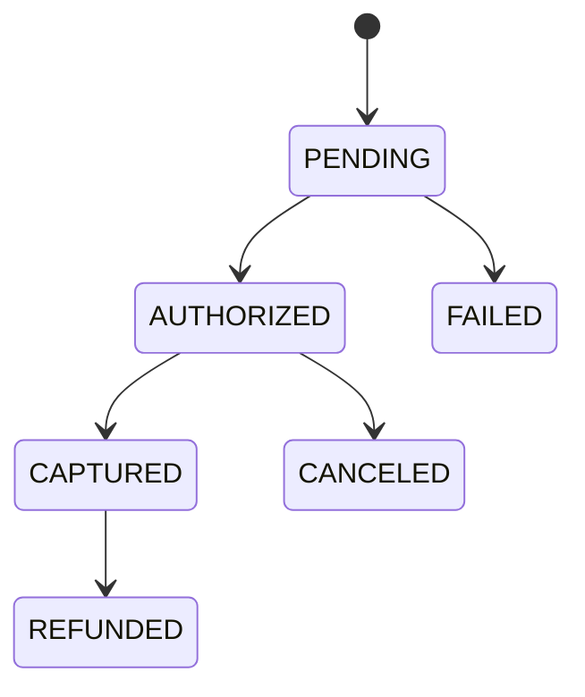

# Payments API (Spring Boot)

Backend de pagamentos em Spring Boot com documentação OpenAPI/Swagger, banco H2 em memória e autenticação simples por API Key.

## Sumário
- Visão geral
- Requisitos e stack
- Como rodar
- Configuração (porta e API key)
- Documentação (Swagger e OpenAPI)
- Banco de dados (H2)
- Segurança (API Key)
- Endpoints da API (com exemplos)
- Modelo de dados e estados
- Erros e códigos de status
- Boas práticas e notas

## Visão geral
Este serviço expõe endpoints REST para criar, consultar, atualizar status e estornar pagamentos. A documentação interativa está disponível via Swagger UI.

## Requisitos e stack
- Java 17+
- Maven 3.9+
- Spring Boot 3.3
- H2 Database (memória)
- Spring Data JPA, Validation, Actuator
- springdoc-openapi (Swagger UI)

## Como rodar
```bash
mvn spring-boot:run
```
Aplicação inicia por padrão em `http://localhost:8085`.

## Configuração
- Porta do servidor: `server.port=8085` (configurada em `src/main/resources/application.properties`).
- API Key: variável de ambiente `PAYMENTS_API_KEY` (default: `dev-key`).
  - Windows PowerShell:
    ```powershell
    setx PAYMENTS_API_KEY "minha-chave-super-secreta"
    ```
  - Linux/macOS (bash):
    ```bash
    export PAYMENTS_API_KEY="minha-chave-super-secreta"
    ```

## Documentação
- Swagger UI: `http://localhost:8085/swagger-ui.html`
- OpenAPI JSON: `http://localhost:8085/v3/api-docs`
- OpenAPI YAML: `http://localhost:8085/v3/api-docs.yaml`

## Banco de dados (H2)
- Console H2: `http://localhost:8085/h2-console`
- JDBC URL: `jdbc:h2:mem:paymentsdb`
- Usuário: `sa` | Senha: (vazia)

## Segurança (API Key)
- Enviar header obrigatório: `X-API-KEY: <sua-chave>`
- Endpoints públicos (sem chave): `/swagger-ui.html`, `/v3/api-docs*`, `/actuator/*`, `/h2-console*`

## Endpoints da API
Base: `http://localhost:8085/api/payments`

1) Criar pagamento
- POST `/api/payments`
- Headers: `Content-Type: application/json`, `X-API-KEY: <chave>`
- Body:
  ```json
  {
    "externalId": "pedido-123",
    "amount": 149.90,
    "currency": "BRL",
    "description": "Assinatura Pro"
  }
  ```
- 201 Created + Location `/api/payments/pedido-123`
- Resposta:
  ```json
  {
    "id": 1,
    "externalId": "pedido-123",
    "amount": 149.90,
    "currency": "BRL",
    "status": "PENDING",
    "description": "Assinatura Pro",
    "createdAt": "2025-01-01T12:00:00Z",
    "updatedAt": "2025-01-01T12:00:00Z"
  }
  ```

2) Listar pagamentos
- GET `/api/payments`
- Headers: `X-API-KEY`
- 200 OK + array de `PaymentResponse`.

3) Buscar por externalId
- GET `/api/payments/{externalId}`
- Headers: `X-API-KEY`
- 200 OK | 400 se não encontrado (mensagem em `message`).

4) Atualizar status
- PATCH `/api/payments/{externalId}/status`
- Headers: `Content-Type: application/json`, `X-API-KEY`
- Body:
  ```json
  { "status": "CAPTURED" }
  ```
  Valores válidos: `PENDING`, `AUTHORIZED`, `CAPTURED`, `FAILED`, `CANCELED`, `REFUNDED`.
- 200 OK: retorna pagamento atualizado.

5) Estornar (refund)
- POST `/api/payments/{externalId}/refund`
- Headers: `Content-Type: application/json`, `X-API-KEY`
- Body:
  ```json
  { "amount": 149.90, "reason": "cliente solicitou" }
  ```
- Regras:
  - Apenas pagamentos `AUTHORIZED` ou `CAPTURED` podem ser estornados.
  - `amount` deve ser > 0 e <= `amount` original.
- 200 OK: retorna pagamento com `status=REFUNDED`.
- 409 CONFLICT se estado inválido para estorno.

### cURL exemplos
```bash
# Criar
curl -X POST http://localhost:8085/api/payments \
  -H "Content-Type: application/json" \
  -H "X-API-KEY: dev-key" \
  -d '{"externalId":"pedido-123","amount":149.90,"currency":"BRL","description":"Assinatura Pro"}'

# Atualizar status
curl -X PATCH http://localhost:8085/api/payments/pedido-123/status \
  -H "Content-Type: application/json" \
  -H "X-API-KEY: dev-key" \
  -d '{"status":"CAPTURED"}'

# Estornar
curl -X POST http://localhost:8085/api/payments/pedido-123/refund \
  -H "Content-Type: application/json" \
  -H "X-API-KEY: dev-key" \
  -d '{"amount":149.90, "reason":"cliente solicitou"}'
```

## Modelo de dados e estados
- Tabela `payments` (H2):
  - `id` (PK, auto)
  - `externalId` (único)
  - `amount` (decimal)
  - `currency` (3 letras, ex: BRL, USD)
  - `status` (enum: `PENDING`, `AUTHORIZED`, `CAPTURED`, `FAILED`, `CANCELED`, `REFUNDED`)
  - `description` (texto curto)
  - `createdAt`, `updatedAt` (timestamps)

Fluxo típico de status:


## Erros e códigos de status
- 400 BAD REQUEST
  - Validação (`MethodArgumentNotValidException`) com lista de mensagens.
  - Regras de negócio (ex.: externalId duplicado, valor inválido).
- 401 UNAUTHORIZED
  - Ausência/erro de `X-API-KEY`.
- 409 CONFLICT
  - Transição de estado inválida para estorno.
- 500 INTERNAL SERVER ERROR
  - Erro inesperado.

Formato de erro (exemplo):
```json
{
  "timestamp": "2025-01-01T12:00:00Z",
  "status": 400,
  "error": "Bad Request",
  "message": ["amount: must be greater than or equal to 0.01"]
}
```

## Boas práticas e notas
- Idempotência: utilize `externalId` único do seu lado para evitar duplicidade na criação.
- Moeda: use padrão ISO 4217 (3 letras), ex.: `BRL`, `USD`.
- Segurança: rotacione sua API Key e prefira segredos via variáveis de ambiente.
- Observabilidade: habilite endpoints do Actuator conforme necessário (já exposto `health`, `info`).

---
Mantido simples para fins de demonstração. Para produção, recomenda-se adicionar autenticação robusta (ex.: OAuth2), logs estruturados, auditoria, métricas e persistência externa (ex.: PostgreSQL).
