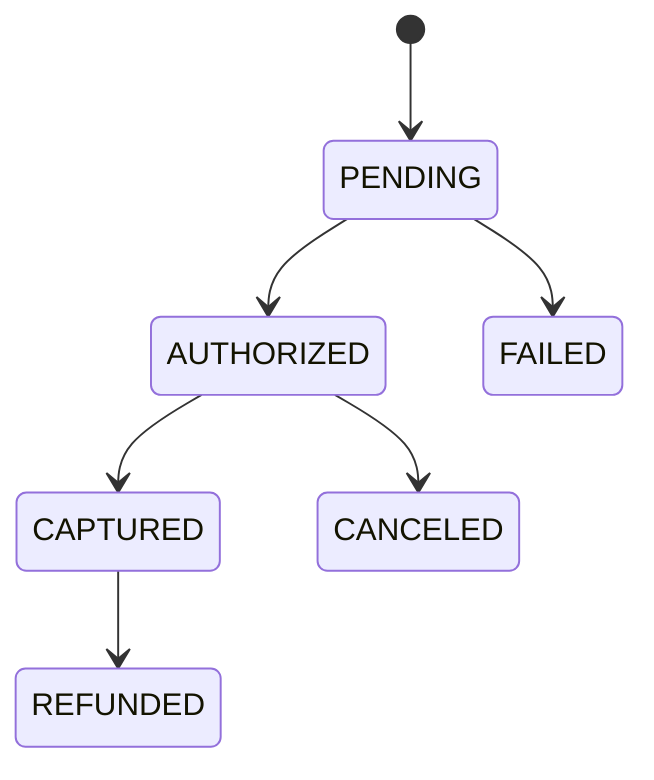

# Payments API (Spring Boot)

Payment backend built with Spring Boot, OpenAPI/Swagger, in-memory H2 database, and simple API Key authentication.

## Table of Contents
- Overview
- Requirements & Stack
- How to Run
- Configuration (port and API key)
- Documentation (Swagger & OpenAPI)
- Database (H2)
- Security (API Key)
- API Endpoints (with examples)
- Data Model & States
- Errors & Status Codes
- Best Practices & Notes

## Overview
This service exposes REST endpoints to create, read, update status, and refund payments. Interactive documentation is available via Swagger UI.

## Requirements & Stack
- Java 17+
- Maven 3.9+
- Spring Boot 3.3
- H2 Database (in-memory)
- Spring Data JPA, Validation, Actuator
- springdoc-openapi (Swagger UI)

## How to Run
```bash
mvn spring-boot:run
```
App starts by default at `http://localhost:8085`.

## Configuration
- Server port: `server.port=8085` (configured in `src/main/resources/application.properties`).
- API Key: environment variable `PAYMENTS_API_KEY` (default: `dev-key`).
  - Windows PowerShell:
    ```powershell
    setx PAYMENTS_API_KEY "my-super-secret-key"
    ```
  - Linux/macOS (bash):
    ```bash
    export PAYMENTS_API_KEY="my-super-secret-key"
    ```

## Documentation
- Swagger UI: `http://localhost:8085/swagger-ui.html`
- OpenAPI JSON: `http://localhost:8085/v3/api-docs`
- OpenAPI YAML: `http://localhost:8085/v3/api-docs.yaml`

## Database (H2)
- H2 Console: `http://localhost:8085/h2-console`
- JDBC URL: `jdbc:h2:mem:paymentsdb`
- User: `sa` | Password: (empty)

## Security (API Key)
- Required header: `X-API-KEY: <your-key>`
- Public endpoints (no key): `/swagger-ui.html`, `/v3/api-docs*`, `/actuator/*`, `/h2-console*`

## API Endpoints
Base: `http://localhost:8085/api/payments`

1) Create payment
- POST `/api/payments`
- Headers: `Content-Type: application/json`, `X-API-KEY: <key>`
- Body:
  ```json
  {
    "externalId": "order-123",
    "amount": 149.90,
    "currency": "BRL",
    "description": "Pro Subscription"
  }
  ```
- 201 Created + Location `/api/payments/order-123`
- Response:
  ```json
  {
    "id": 1,
    "externalId": "order-123",
    "amount": 149.90,
    "currency": "BRL",
    "status": "PENDING",
    "description": "Pro Subscription",
    "createdAt": "2025-01-01T12:00:00Z",
    "updatedAt": "2025-01-01T12:00:00Z"
  }
  ```

2) List payments
- GET `/api/payments`
- Headers: `X-API-KEY`
- 200 OK + array of `PaymentResponse`.

3) Get by externalId
- GET `/api/payments/{externalId}`
- Headers: `X-API-KEY`
- 200 OK | 400 if not found (error message in `message`).

4) Update status
- PATCH `/api/payments/{externalId}/status`
- Headers: `Content-Type: application/json`, `X-API-KEY`
- Body:
  ```json
  { "status": "CAPTURED" }
  ```
  Valid values: `PENDING`, `AUTHORIZED`, `CAPTURED`, `FAILED`, `CANCELED`, `REFUNDED`.
- 200 OK: returns the updated payment.

5) Refund
- POST `/api/payments/{externalId}/refund`
- Headers: `Content-Type: application/json`, `X-API-KEY`
- Body:
  ```json
  { "amount": 149.90, "reason": "customer requested" }
  ```
- Rules:
  - Only `AUTHORIZED` or `CAPTURED` payments can be refunded.
  - `amount` must be > 0 and <= original `amount`.
- 200 OK: returns payment with `status=REFUNDED`.
- 409 CONFLICT if invalid state for refund.

### cURL examples
```bash
# Create
curl -X POST http://localhost:8085/api/payments \
  -H "Content-Type: application/json" \
  -H "X-API-KEY: dev-key" \
  -d '{"externalId":"order-123","amount":149.90,"currency":"BRL","description":"Pro Subscription"}'

# Update status
curl -X PATCH http://localhost:8085/api/payments/order-123/status \
  -H "Content-Type: application/json" \
  -H "X-API-KEY: dev-key" \
  -d '{"status":"CAPTURED"}'

# Refund
curl -X POST http://localhost:8085/api/payments/order-123/refund \
  -H "Content-Type: application/json" \
  -H "X-API-KEY: dev-key" \
  -d '{"amount":149.90, "reason":"customer requested"}'
```

## Data Model & States
- Table `payments` (H2):
  - `id` (PK, auto)
  - `externalId` (unique)
  - `amount` (decimal)
  - `currency` (3 letters, e.g., BRL, USD)
  - `status` (enum: `PENDING`, `AUTHORIZED`, `CAPTURED`, `FAILED`, `CANCELED`, `REFUNDED`)
  - `description` (short text)
  - `createdAt`, `updatedAt` (timestamps)

Typical status flow:


## Errors & Status Codes
- 400 BAD REQUEST
  - Validation (`MethodArgumentNotValidException`) with a list of messages.
  - Business rules (e.g., duplicate externalId, invalid value).
- 401 UNAUTHORIZED
  - Missing/invalid `X-API-KEY`.
- 409 CONFLICT
  - Invalid state transition for refund.
- 500 INTERNAL SERVER ERROR
  - Unexpected error.

Error format (example):
```json
{
  "timestamp": "2025-01-01T12:00:00Z",
  "status": 400,
  "error": "Bad Request",
  "message": ["amount: must be greater than or equal to 0.01"]
}
```

## Best Practices & Notes
- Idempotency: use a unique `externalId` on your side to avoid duplicate creations.
- Currency: use ISO 4217 (3-letter), e.g., `BRL`, `USD`.
- Security: rotate your API Key and prefer environment variables for secrets.
- Observability: enable more Actuator endpoints as needed (currently exposes `health`, `info`).

---
Kept intentionally simple for demonstration. For production, consider robust authentication (e.g., OAuth2), structured logging, audit trails, metrics, and an external database (e.g., PostgreSQL).
